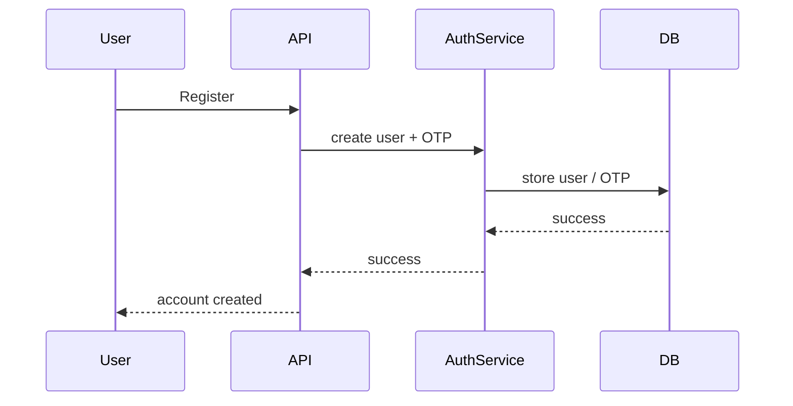

# Cipher Backend Authentication System

## Overview
This backend now uses a modular authentication architecture with validation, secure password handling, JWT-based sessions, RBAC concepts, centralized errors, and production-oriented middleware.

## Architecture
- Controllers: request entry points
- Services: business logic
- Models: database schemas
- Validators: request validation with Zod
- Middlewares: auth, validation, errors, rate limiting
- Exceptions: domain-specific errors
- Config: environment and runtime settings

## Authentication Flow

## Security Decisions
- bcryptjs for password hashing
- JWT access and refresh tokens
- Refresh token rotation
- Helmet and CORS enabled
- Rate limiting on auth endpoints
- Centralized error handling

## Environment Variables
- PORT
- MONGODB_URI
- JWT_SECRET
- CLIENT_URL
- CORS_ORIGIN
- COOKIE_SECRET
